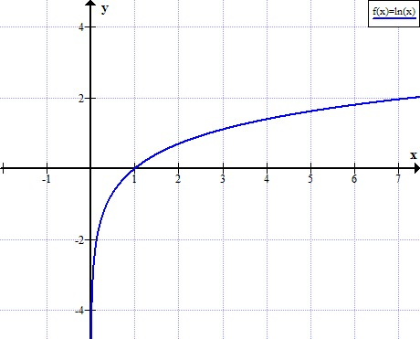
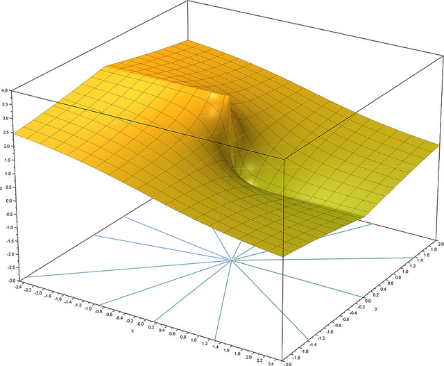

# Napier.jl

Compute natural logarithm in Julia Language.
This module is based on https://github.com/thinkphp/napier.

## Installation

`julia> Pkg.clone("https://github.com/moisespsena/Napier.jl.git")`

## Usage

`using Napier`

## Functions

- `Napier.loge(n::Real, li::Real, ls::Real)`
- `Napier.logn(n::Real)` or `Napier.ln(n::Real)`

# About

## NOTE

  ln(a) = x <=> a = e^x => f(x) = e^x - a => f : (0, infinit) --> R

## References

[The Napier logarithm](http://www.rapidtables.com/math/algebra/Ln.htm)

